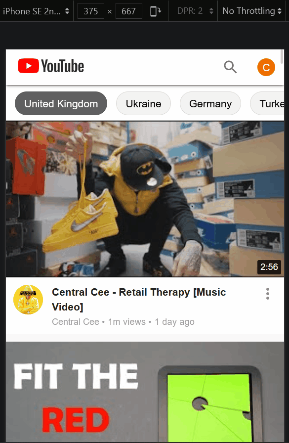
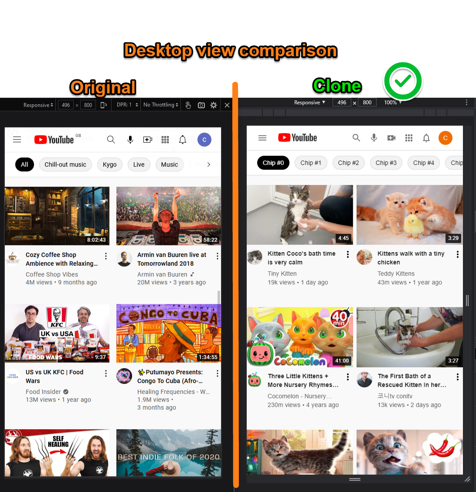
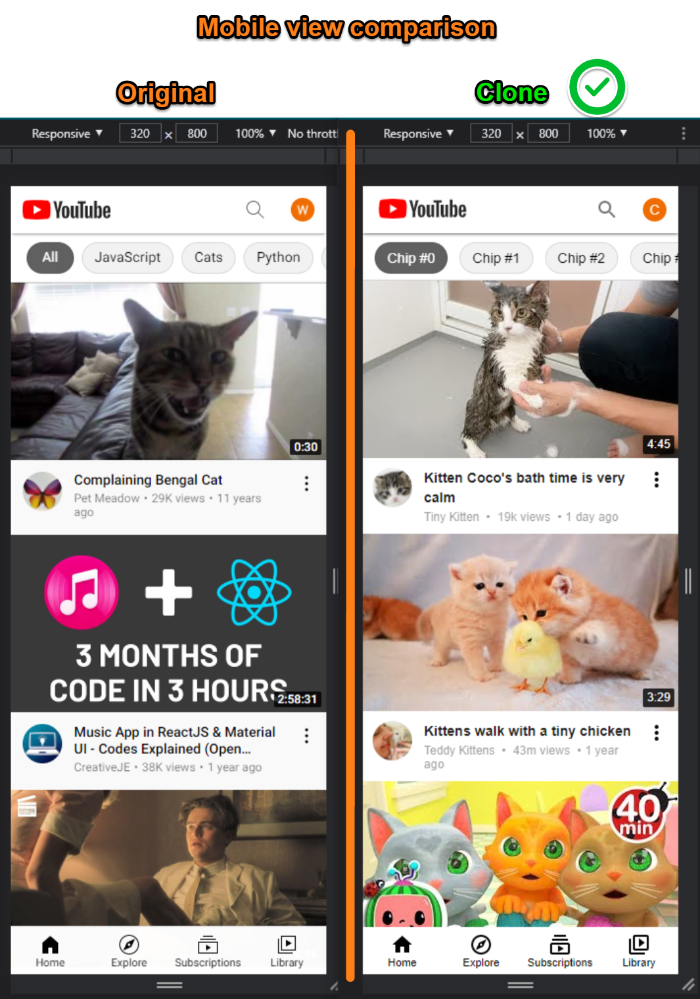
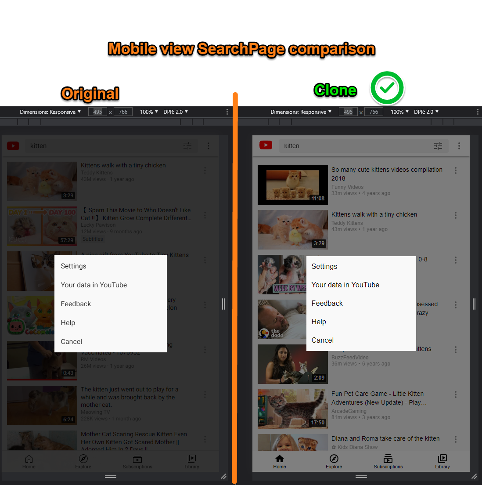

# React YouTube clone

### Or Go to the live site and try it for yourself [here](https://react-youtubeclone.netlify.app/)

## WARNING
<strong> if the app does not load anything or the search function doesn't work, it is very likely the daily YouTube API quota has exceeded. There are only 5000 daily quotas for free usage, and each search costs 100 quotas. If the app doesn't work, I hope the animated GIF here can give you an idea of how it works. </strong>

## Mobile view search function demo

## What does this app do?

- It is a clone of YouTube HomePage and SearchPage.
- HomePage displays the most popular videos of the selected country by querying data from the YouTube API.
- HomePage utilizes infinite-scroll feature, so new videos thumbnails will load when the user keeps scrolling down the page.
- Typing a word and clicking on search does a real search on YouTube API, 25 results are displayed on the SearchPage.

## What is this project about?

- This is mainly a material-ui and styled-components learning project. I aimed at making the website look as close to the original YouTube as possible.
- This project ends up turning into a state and complexity management exercise too because as the project progressed, I realized it is much bigger than I thought.

## What technologies were used?

- react.js (create-react-app)
- react-router
- axios
- styled-components
- Material-UI v4
- jotai

## Links to source code and live site:

- [Live site hosted on Netlify](https://react-youtubeclone.netlify.app/)
- [Source code on Github](https://github.com/1codingguy/react-youtube-clone)

## Detailed side-by-side comparison of the clone to the original

